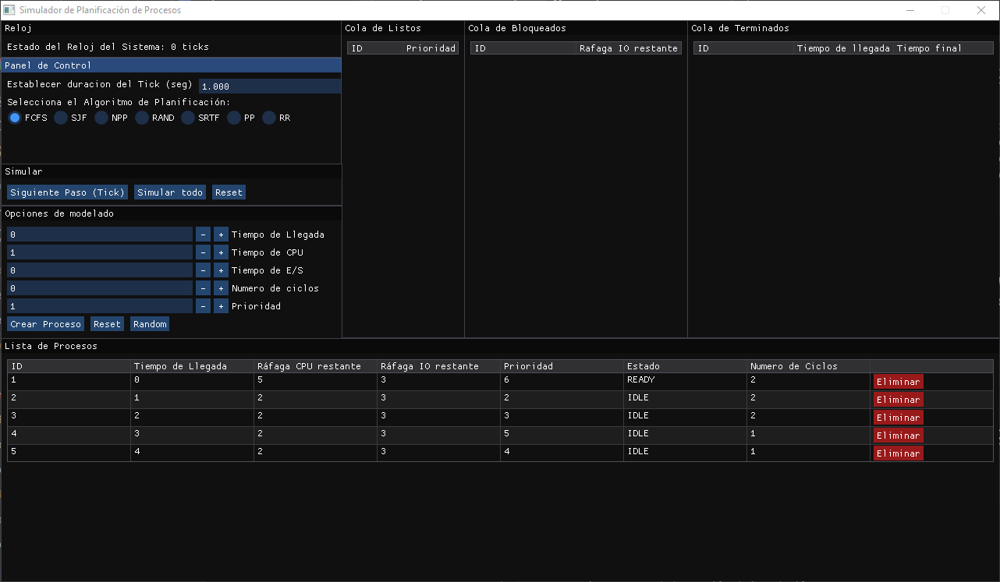

# OS - Simulador de Planificación de Procesos

Este proyecto es un simulador interactivo diseñado para modelar y analizar el comportamiento de diferentes algoritmos de planificación de procesos en un sistema operativo. La aplicación cuenta con una interfaz gráfica intuitiva desarrollada con **Dear ImGui** y **GLFW**, lo que permite visualizar en tiempo de ejecución las ráfagas de CPU, los estados de los procesos (Listo, Ejecutando, Bloqueado) y las métricas de rendimiento del sistema de forma dinámica y fluida.

---

## 🚀 Clonar el Repositorio
Para descargar el código fuente en tu máquina local, ejecuta:
```bash
git clone https://github.com/Lukar10Y/OS-Simulador-de-Planificacion-de-Procesos.git
cd OS-Simulador-de-Planificación-de-Procesos
```

## 🛠️ Requisitos e Instalación

El proyecto es multiplataforma y está preparado para compilarse tanto en entornos Windows nativos como en sistemas basados en Linux.

### 🐧 Opción 1: Linux (incluyendo WSL 2 / Ubuntu de Microsoft Store)

Si estás utilizando **Ubuntu en WSL 2**, el sistema gráfico requiere instalar primero las dependencias de desarrollo de X11 y OpenGL. Ejecuta los siguientes comandos en tu terminal para preparar el entorno:

```bash
# Actualizar el gestor de paquetes
sudo apt update

# Instalar las librerías necesarias para el entorno gráfico, hilos y compilación
sudo apt install -y build-essential libglfw3-dev libgl1-mesa-dev
```
Una vez instaladas las dependencias, compila con:

```bash
make
```
y ejecuta el simulador con:
```bash
./simulador
```

### 🖥️ Opción 2: Windows (Nativo)
Para el entorno de Windows, el repositorio ya incluye los binarios precompilados de la librería GLFW, por lo que no necesitas descargar dependencias adicionales de forma manual.

Si utilizas una terminal nativa de Windows configurada con make y un compilador como MinGW/GCC, compila y ejecuta de la misma manera:

```bash
make
./simulador
```

### 🧹 Limpieza del Proyecto
Si deseas borrar los archivos objeto (.o) y el ejecutable generado para realizar una compilación limpia desde cero, ejecuta:

```bash
make clean
```

## 🎮 Instrucciones de Uso
El simulador cuenta con 5 procesos de ejemplo precargados al iniciar. Al tratarse de una simulación en memoria volátil, los datos se reiniciarán por completo cada vez que se cierre la aplicación.

## 1. Configuración Previa a la Simulación
Antes de iniciar la ejecución de los algoritmos, puedes interactuar con los siguientes paneles:

* Panel de Control: Permite seleccionar el algoritmo de planificación a evaluar (FCFS, SJF, NPP, RAND, SRTF, PP, RR) y configurar el tiempo de duración (en segundos) de cada tick de reloj.

* Creación de Procesos: En el panel de opciones de modelado, puedes añadir procesos personalizados definiendo manualmente su Tiempo de Llegada, ráfaga de CPU, operaciones de I/O (Entrada/Salida), Número de Ciclos y su Prioridad.

* Cuenta con un botón Reset para limpiar los campos del formulario.

* Cuenta con un botón Random para generar un proceso con características aleatorias automáticamente.

* Eliminación de Procesos: En la lista lateral de procesos, aparecerá un botón de eliminación en color rojo al costado derecho de cada proceso (disponible únicamente antes de iniciar la simulación).

## 2. Control de la Simulación
Durante la ejecución, los recuadros principales listarán dinámicamente los procesos divididos según su estado actual: READY (Listo), BLOCKED (Bloqueado) o TERMINATED (Terminado). Dispones de dos modos de ejecución:

* Paso a Paso: Avanza manualmente un ciclo a la vez utilizando el botón Siguiente Tick.

* Automático: Ejecuta la simulación de forma continua respetando el intervalo de tiempo configurado.

📊 Nota sobre las Métricas: Al iniciar la simulación, el panel de configuración de modelado se ocultará automáticamente para dar lugar a las Métricas de Rendimiento del Sistema, las cuales mostrarán los resultados finales de la planificación.

## 3. Reinicio
Una vez finalizada la simulación (o si deseas detenerla), puedes presionar el botón Reset global. Esto restaurará el simulador a su estado inicial, conservando los procesos que cargaste o creaste al principio para que puedas probarlos con un algoritmo diferente.

## Preview


## 👤 Autor
* Francisco Ochoa - C.I: 30.189.260
